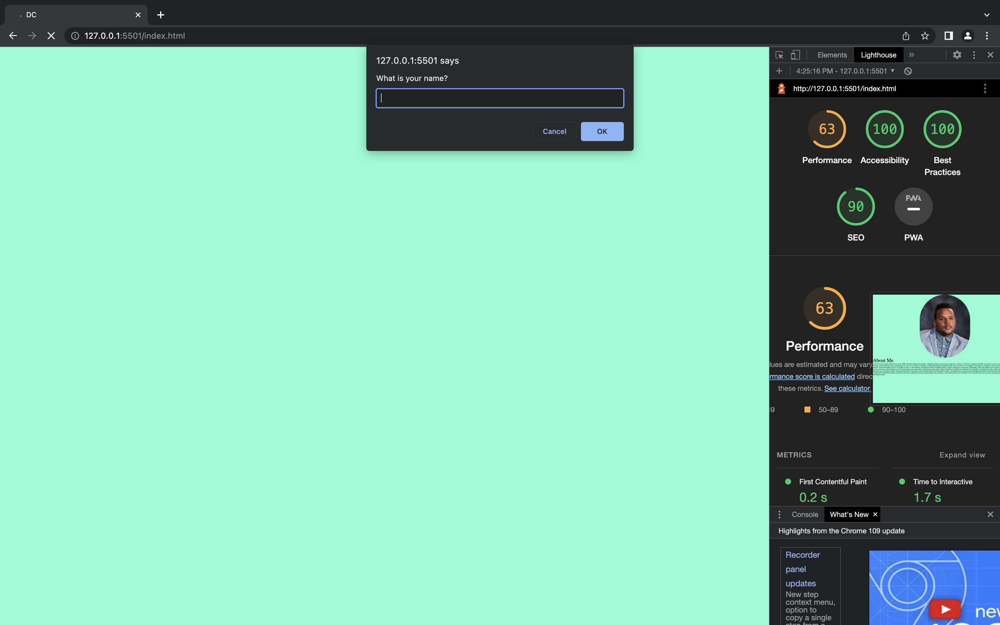

# # LAB - 2

## About Me

I build an app with a direct and powerful purpose. It does all of the things that it accomplishes well. I should describe the purpose and functionality so those that visit my README understand the app

### Author: Deon C./Group name

### Links and Resources

* [submission PR](http://xyz.com)
* Any Links you used as reference

### Lighthouse Accessibility Report Score

* Provide a screenshot of your score after running a Lighthouse Accessibility report.

### Reflections and Comments

How did this go, overall?

Overall, the assignment was a challenging but enjoyable experience. I found it very interesting to learn new ways to use HTML, JS functions, and how small changes in the code can have a big impact on the final outcome.

What observations or questions do you have about what you’ve learned so far?

One observation I have is that I would like to learn more about how to complete a loop that will force a response from the user. I understand that this is an important aspect of coding, but I am not yet proficient in it.

How long did it take you to complete this assignment? And, before you started, how long did you think it would take you to complete this assignment?

In terms of time, it took me 3.5 hours to complete the assignment. Before starting, I had thought it would take me days to complete, but with the help of class information and TA support, I was able to complete it much more quickly than I had anticipated.

Overall, I am very satisfied with my progress on this assignment, and I am looking forward to continuing to learn and improve my coding skills in the future.

### Lab4 Partner
Navigator: Deon
Driver: Thomas